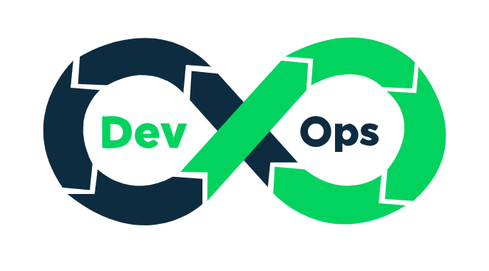

# TFM — Analysis of Cloud-Based Deployments for O-RAN Architecture

In today’s technological landscape, DevOps engineering plays a key role in automating and optimizing software delivery. The adoption of cloud computing has further accelerated this transformation. As industries increasingly move towards 5G networks, the need for automated, scalable, and secure cloud infrastructures has never been more important. An example of this is the recent architecture Open-Radio Access Network (O-RAN). This thesis focuses on analyzing the deployment, automation, and optimization of the O-RAN architecture in a cloud-based 5G simulation environment, using Infrastructure as Code (IaC) principles. The project leverages Terraform and Ansible to automate the deployment process, with a comparative analysis of cloud providers. Monitoring tools such as Prometheus and Grafana are integrated to visualize the system performance and set up alerting mechanisms for proactive system management. This thesis demonstrates how modern DevOps practices, combined with cloud technologies and O-RAN framework, enable scalable and secure 5G networks through automation and monitoring.

  
  

